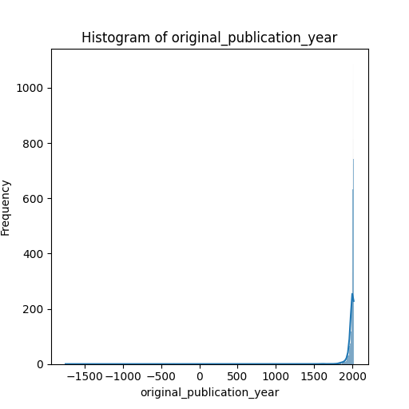

# README.md

## Goodreads Dataset Analysis

### Overview

The `goodreads.csv` dataset contains a wealth of information about books listed on Goodreads, one of the largest social cataloging website for books. With a total of **10,000 entries** and **23 columns**, this dataset offers insights into various attributes including authors, publication years, ratings, and reviews.

### Dataset Summary

#### Shape
- **Rows:** 10,000
- **Columns:** 23

#### Key Columns
- **book_id:** Unique identifier for each book.
- **authors:** Author(s) of the book.
- **original_publication_year:** Year the book was first published.
- **average_rating:** The average rating of the book.
- **ratings_count:** Total number of ratings received.
- **work_ratings_count:** Number of ratings for the work, considering different editions of the same book.
- **rating categories (ratings_1 to ratings_5):** Breakdown of how many ratings each score from 1 to 5 received.

### Missing Values Analysis
While the dataset is mostly complete, there are some columns with missing values:
- **isbn:** 700 missing entries
- **isbn13:** 585 missing entries
- **original_publication_year:** 21 missing entries
- **original_title:** 585 missing entries
- **language_code:** 1084 missing entries

This suggests some inconsistencies or unavailability of specific identifiers and publication details across various books.

### Insights and Unique Characteristics

#### 1. Author Diversity
The column `authors` contains a plethora of unique authors, indicating the dataset's comprehensive coverage of authors from various genres. Analyzing the count of unique authors can provide insights into authors with one or multiple works in this dataset.

#### 2. Rating Trends
With a mean average rating of approximately **4.1**, the dataset exhibits a generally positive reception for books. Further investigation into the `ratings_count` and `work_ratings_count` could reveal how popularity correlates with average ratings. 

#### 3. Publication Year Trends
The `original_publication_year` column allows us to assess the temporal trends in ratings and reviews. Are newer books rated more highly than classics? By grouping data by decade, we can extract interesting insights regarding shifts in reader preferences over time.

#### 4. Language Distribution
The presence of languages indicated in `language_code` allows for the exploration of international literature. The large number of missing entries here might point to a predominance of English literature in the data but raises questions about global representation.

#### 5. Ratings Breakdown
The fine-grained breakdown of ratings (from `ratings_1` to `ratings_5`) provides an opportunity to explore not just the average ratings but the distribution. Are books typically rated high (4-5) or is there significant low-rating feedback? An analysis could reveal the sentiment and delineate popular versus polarizing books.

#### 6. Image Representation
The `image_url` and `small_image_url` columns, while not directly influential to ratings or reviews, play a role in user engagement on platforms like Goodreads. Analysis here could show how visuals correlate with higher ratings or engagement.

### Possible Analyses

- **Correlation Analysis:** Assess correlations between `average_rating`, `ratings_count`, and `work_ratings_count` for potential prediction models.
- **Trend Over Time:** Visualize how average ratings have changed over years of publication using time series plots.
- **Ratings Distribution:** Query and visualize the distribution of ratings across books to understand the spread and identify outliers.
- **Author Popularity:** Analyze which authors have the most highly rated books and how their frequency appears in the dataset.

### Conclusion & Future Work

The `goodreads.csv` dataset is rich with potential for analysis and insights into reader behaviors, preferences, and trends in book ratings. Future work can benefit from deeper statistical modeling, machine learning techniques for prediction, and potentially extending the dataset by scraping additional attributes from Goodreads or integrating other literary databases for a comprehensive view.

---

This document serves as an introduction to the dataset and a roadmap for analysis. Each section can be expanded upon based on findings and insights gathered during the analysis phase. Happy analyzing!
## Analysis of histogram

The histogram displays the distribution of publication years for a dataset, primarily focusing on the variable "original_publication_year." The x-axis is labeled with years, ranging from -1500 to 2000, while the y-axis indicates frequency.

Key Insights:

1. **Skewed Distribution**: The histogram exhibits a significant skew to the right, indicating a majority of publications are concentrated in more recent years, particularly in the late 20th century to early 21st century. There is a clear peak suggesting many publications are from this time frame.

2. **Outliers**: The range from -1500 to 1700 appears to have very low frequencies, suggesting these are outliers. This may include historical texts or misentries that could require further inspection.

3. **Data Completeness**: The lack of data points before a certain year's threshold�likely around the 18th century�indicates a possible change in data collection practices or publication trends over time.

4. **Publication Trends**: The visualization reveals a potential growth in the number of publications over time, corresponding with advancements in technology, education, and availability of printing resources since the 1800s.

Recommendations for Further Analysis:

- **Data Cleaning**: Consider removing or investigating outliers for more accurate insights.
- **Time Series Analysis**: Examine trends over specific decades for a detailed understanding of publication patterns.
- **Categorization**: Analyze the topics or genres of publications over time to identify shifts in scholarly focus. 

This analysis allows for a better understanding of trends in the dataset, guiding future research directions.
