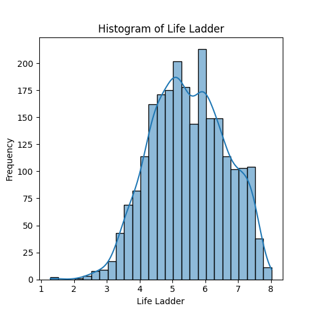

# Happiness Dataset Analysis

## Overview
The dataset titled `happiness.csv` contains a wealth of information collected from 165 countries over 18 years, with a total of 2,363 observations. It serves as a compelling resource for assessing the various factors that influence happiness across nations. The dataset comprises 11 columns, detailing metrics such as the "Life Ladder," "Log GDP per capita," social support, and other indicators that speak volumes about the quality of life and subjective well-being in different regions.

## Structure
- **Shape:** 2363 rows and 11 columns
- **Columns:** 
  - `Country name`: Name of the country
  - `year`: Year of the measurement
  - `Life Ladder`: A self-reported measure of subjective well-being (happiness)
  - `Log GDP per capita`: Economic benchmark of prosperity
  - `Social support`: Support systems available to individuals
  - `Healthy life expectancy at birth`: Robustness of health systems
  - `Freedom to make life choices`: Liberties citizens experience
  - `Generosity`: Altruistic behaviors in society
  - `Perceptions of corruption`: Trust in government and institutions
  - `Positive affect`: Instances of positive emotions
  - `Negative affect`: Instances of negative emotions

## Key Insights

### 1. Temporal Dynamics
The dataset spans from 2005 to 2023, showcasing dynamic shifts in happiness indicators over the years. The average `Life Ladder` score appears to have increased softly from a low of 4.647 pre-2015 to a noteworthy progression of 6.323 by 2019. This trend implies an upward trajectory in life satisfaction levels, hinting at improvements in social and economic conditions across many countries.

### 2. Economic Influence
The mean `Log GDP per capita` is approximately 9.4 with a standard deviation of 1.15, reflecting a significant base of economic disparity. The correlation between `Log GDP per capita` and the `Life Ladder` is critical. Nations with higher GDP per capita tend to report greater levels of happiness, indicating that economic prosperity plays a pivotal role in subjective well-being.

### 3. Social and Health Parameters
With an average `Social support` score of 0.81, it suggests that individuals generally feel there is available support from others in their communities. This support coupled with `Healthy life expectancy at birth` averaging around 63.4 years serves to accentuate the significant influence of health and community well-being on life satisfaction.

### 4. Liberty and Generosity
The data yields an interesting paradox with `Freedom to make life choices` scoring 0.75 on average. While individuals express a certain level of freedom, the low average score for `Generosity` (0.0001) raises the question of whether freedom translates to acts of solidarity among citizens, which could significantly enhance perceived happiness.

### 5. Emotional Well-being
Further analysis regarding emotions reveals that the mean `Positive affect` is around 0.65 while `Negative affect` stands at 0.27, indicating a relatively healthy emotional balance although it would benefit from deeper examination. The low levels of negative emotions across sampled countries correlate positively with higher happiness scores.

## Unique Characteristics
- Diversity of Data: The inclusion of metrics like `Perceptions of corruption` draws a unique link between feelings of security and overall happiness, suggesting the need for robust governance.
- Missing Data: Certain metrics display notable missing values, especially in `Generosity` and `Perceptions of corruption`, which may impact analyses significantly and emphasizes the need for careful data treatment.

## Conclusion
The `happiness.csv` dataset unfolds an intriguing narrative about global happiness and the multifaceted elements influencing it. The interplay between economic variables, social dimensions, and emotional experiences crafts a comprehensive picture that could serve policymakers and researchers seeking to enhance the quality of life across nations. Future work should focus on bridging missing data gaps and elucidating the deeper interrelations among the dimensional variables to tap into actionable insights that elevate collective well-being.
## Analysis of histogram

## Histogram Analysis: Life Ladder

This histogram visualizes the distribution of the Life Ladder scores, which likely represent subjective well-being across a population. The x-axis denotes the Life Ladder scores ranging from 1 to 8, while the y-axis indicates the frequency of responses for each score.

### Key Insights:

1. **Distribution Shape**: The histogram presents a bimodal distribution with peaks around scores 5 and 6. This suggests that a significant proportion of respondents report moderate to high life satisfaction.

2. **Frequency Concentration**: The most frequently reported scores are concentrated between 5 and 7, indicating a tendency toward higher life satisfaction in the surveyed population. Scores below 4 show markedly lower frequencies, suggesting that very low life satisfaction is uncommon.

3. **Normal Distribution Characteristics**: Despite the bimodal peaks, the overall shape appears somewhat symmetrical, resembling a normal distribution, particularly in the mid-range scores.

4. **Trends and Gaps**: There is a notable drop-off in frequency for scores above 7, suggesting fewer individuals experience very high levels of life satisfaction. Furthermore, gaps in the histogram illustrate that certain scores (like 4 and 5) are more common than others.

### Conclusion:

The histogram of Life Ladder scores indicates that most individuals report moderate to high life satisfaction, with notable peaks at scores 5 and 6. This information can inform policy decisions and well-being initiatives by highlighting the areas where satisfaction can be improved. Understanding these trends is crucial for evaluating societal well-being and addressing potential areas for growth or support.

