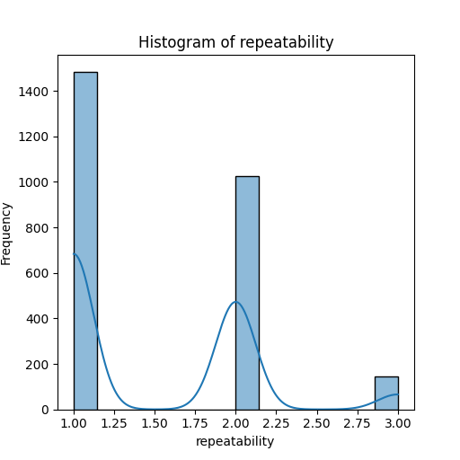

# README.md

## Dataset Overview: Media.csv

Welcome to the `media.csv` dataset, a comprehensive collection of media titles, including movies, their languages, ratings, and other relevant information. With 2,652 entries spread across 8 distinct columns, this dataset provides a rich source of information for anyone interested in exploring trends and insights in the media landscape.

### Dataset Shape
- **Total Entries (Rows):** 2652
- **Total Attributes (Columns):** 8

### Columns
The dataset contains the following columns:

1. **date**: The release date of the media.
2. **language**: The language in which the media is produced.
3. **type**: The type of media (in this case, primarily movies).
4. **title**: The title of the media.
5. **by**: The creators or stars associated with the media.
6. **overall**: An overall rating of the media on a scale from 1 to 5.
7. **quality**: A quality score indicating the production value.
8. **repeatability**: A metric representing how likely the media is to be re-watched.

### Key Insights
#### 1. Popularity of Languages
The dataset showcases media produced in 11 different languages, reflecting a diverse range of cultural backgrounds. The top language is English, followed closely by Tamil, and the dataset includes lesser-represented languages, enriching its diversity.

#### 2. Types of Media
With 2,652 entries, the dataset primarily consists of movies, with only 8 different types of media represented. The overwhelming majority of entries (2,211 instances) are classified as movies.

#### 3. Release Date Trends
Out of the 2,652 entries, the data comprises titles released from various dates, up to recent years. Notably, entries start from as early as **21-May-2006**, providing a historical view of media trends over time.

#### 4. Title Popularity
Among the 2,312 unique titles, "Kanda Naal Mudhal" stands out as the most frequently occurring title, appearing 9 times in the dataset. This suggests significant viewer engagement or possible re-releases.

#### 5. Ratings Overview
The average overall rating across movies is approximately **3.05**, with a standard deviation of **0.76**, indicating a generally favorable reception but with notable variability. The ratings show that:
- **Minimum Rating**: 1
- **Maximum Rating**: 5

The distribution is likely skewed towards positive ratings, with most titles clustering around the average rating.

#### 6. Quality Assessment
The mean quality rating is around **3.21**, with a standard deviation of **0.80**. This metric provides insights into how the production quality of these movies is perceived, indicating a fairly positive assessment overall.

#### 7. Repeatability Insights
The repeatability metric has a mean of approximately **1.49**, suggesting that most titles are not frequently re-watched, reflecting a pattern typical for one-time viewing films.

### Missing Values
The dataset reveals some missing entries:
- **date**: 99 missing values out of 2,652
- **by**: 262 missing entries

### Sample Rows
Here's a glimpse of some sample entries from the dataset:

| date       | language | type  | title                     | by                           | overall | quality | repeatability |
|------------|----------|-------|---------------------------|------------------------------|---------|---------|---------------|
| 15-Nov-24  | Tamil    | movie | Meiyazhagan               | Arvind Swamy, Karthi        | 4       | 5       | 1             |
| 10-Nov-24  | Tamil    | movie | Vettaiyan                 | Rajnikanth, Fahad Fazil     | 2       | 2       | 1             |
| 09-Nov-24  | Tamil    | movie | Amaran                    | Siva Karthikeyan, Sai Pallavi| 4       | 4       | 1             |
| 11-Oct-24  | Telugu   | movie | Kushi                     | Vijay Devarakonda, Samantha  | 3       | 3       | 1             |
| 05-Oct-24  | Tamil    | movie | GOAT                      | Vijay                        | 3       | 3       | 1             |

### Conclusion
The `media.csv` dataset holds a wealth of insights regarding the preferences and trends in media consumption. By analyzing its components, researchers and analysts can unravel intriguing narratives about language diversity, audience reception, and media production quality over time. The narrative does not stop here — there's much more to explore! Dive deeper and uncover patterns that could help shape future media strategies and outreach.
## Analysis of histogram

# Key Insights and Analysis

This histogram illustrates the distribution of a dataset on "repeatability," highlighting key metrics and trends.

## Distribution Overview
- **Bimodal Distribution**: The histogram exhibits two distinct peaks around repeatability values of 1.25 and 2.00, suggesting that the dataset may contain two different underlying groups or behaviors.
- **Frequency**: The first peak around 1.25 shows a significantly high frequency, with over 1400 instances. This indicates that a majority of observations fall within this range, representing a common characteristic of the dataset.
  
## Central Tendencies
- The second peak at 2.00, while less pronounced, still shows notable activity, implying that there's a subset of data with a higher repeatability score.
- The tail extends toward higher values (up to 3.00), but with decreasing frequency, indicating that while some observations exist in this range, they are relatively rare.

## Insights
- **Quality Assessment**: The presence of two peaks may reflect the effectiveness of certain processes or tools utilized in the measurements related to repeatability.
- **Potential Clusters**: Investigating the factors leading to these clusters can be beneficial. It could suggest differentiated categories such as varying methods, conditions, or instruments affecting repeatability results.

## Recommendations
- Further analysis, possibly employing clustering techniques or segmentation, is recommended to explore the causes of the bimodal distribution.
- Collecting additional contextual data could provide insights into why certain repeatability scores are more prevalent, informing improvements in processes or systems.

