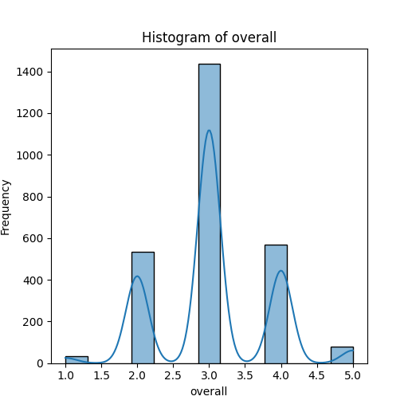

```markdown
# Media Dataset Analysis

## Overview

Welcome to the analysis of the media dataset, encapsulated in the `media.csv` file. This dataset serves as a rich repository of media entries, recording intricate details about various films across different attributes. The dataset comprises **2652 entries** and **8 columns**, offering insights into language, type, overall ratings, quality assessments, and repeatability of media content. As we delve into this analysis, we'll unpack the stories woven within the numbers and trends that emerge, unveiling the unique characteristics of this media landscape.

## Dataset Structure

- **Total Entries**: 2652
- **Columns**:
  - `date`: Date of release
  - `language`: Language of the media
  - `type`: Type of media (e.g., movie)
  - `title`: Title of the media
  - `by`: Creators or main artists involved
  - `overall`: Overall rating (scale of 1 to 5)
  - `quality`: Quality rating (scale of 1 to 5)
  - `repeatability`: How often the media is considered worth rewatching (scale of 1 to 3)

### Summary Statistics

| Statistic        | Overall Rating  | Quality Rating | Repeatability  |
|------------------|----------------|----------------|----------------|
| Count            | 2652           | 2652           | 2652           |
| Unique Values    | N/A            | N/A            | N/A            |
| Mean             | 3.05           | 3.21           | 1.49           |
| Standard Deviation| 0.76          | 0.80           | 0.60           |
| Minimum          | 1              | 1              | 1              |
| Maximum          | 5              | 5              | 3              |

### Key Insights

1. **Release Trends**: 
   The dataset encapsulates a timeline of media releases over a span of years, with **2055 unique dates** recorded. Analyzing the time series aspect could reveal trends in media production and audience reception across various timeframes.

2. **Language Diversity**: 
   With entries in **11 different languages**, the dataset reflects a multicultural representation of media. The **dominance of the English language (1306 entries)** indicates a significant potential audience, while Tamil and Telugu entries portray a strong regional presence.

3. **Media Types**: 
   Almost all entries pertain to the type "movie", with **2211 occurrences**. Although focused primarily on movies, this raises questions about the distribution of media types (e.g., documentaries, series), suggesting a need for expanded data categories in future datasets.

4. **Rating Distribution**:
   The overall rating average lies at **3.05**, while the quality rating averages **3.21**. Both metrics suggest a generally positive reception, yet with notable room for improvement. More intriguing is the standard deviation, indicating variability in viewer experiences and perceptions.

5. **Repeatability Factor**: 
   The repeatability metric, averaging **1.49**, suggests that most media items are not perceived as particularly rewatchable. This could imply that while initial viewings might be enjoyable, subsequent viewings do not hold the same appeal.

### Missing Values Analysis

The dataset has **99 missing values** in the `date` field and **262 missing entries** in the `by` field. This could impact any time-sensitive analysis and might lead to the omission of valuable creators:

- **Date Field**: Missing dates require remediation, possibly by interpolating based on available data or further data collection.
- **By Field**: The significant number of missing entries in the creators’ names calls for either validation of the sources or the addition of known contributors to enhance the dataset richness.

## Sample Data Preview

| date        | language | type  | title               | by                             | overall | quality | repeatability |
|-------------|----------|-------|---------------------|--------------------------------|---------|---------|---------------|
| 15-Nov-24   | Tamil    | movie | Meiyazhagan         | Arvind Swamy, Karthi          | 4       | 5       | 1             |
| 10-Nov-24   | Tamil    | movie | Vettaiyan           | Rajnikanth, Fahad Fazil       | 2       | 2       | 1             |
| 09-Nov-24   | Tamil    | movie | Amaran              | Siva Karthikeyan, Sai Pallavi | 4       | 4       | 1             |
| 11-Oct-24   | Telugu   | movie | Kushi               | Vijay Devarakonda, Samantha    | 3       | 3       | 1             |
| 05-Oct-24   | Tamil    | movie | GOAT                | Vijay                          | 3       | 3       | 1             |

## Conclusion

The `media.csv` dataset offers a kaleidoscopic view into the world of contemporary cinema, endowed with unique stories and patterns waiting to be discovered. Understanding these intricacies can guide stakeholders in media production, distribution, and marketing, ensuring a richer connection between the creators and their audiences. Future work will involve visualizing these trends and further cleaning the dataset to enhance the accuracy of the insights generated. 

Stay tuned for deeper analyses and visual storytelling as we unravel more layers of this dataset!
```

## Analysis of histogram


This histogram illustrates the distribution of the "overall" ratings from a dataset. The x-axis represents the rating values ranging from 1 to 5, while the y-axis shows the frequency of these ratings. 

Key Observations:

1. **Bimodal Distribution**: The histogram shows two distinct peaks, suggesting a bimodal distribution. The first peak occurs around 2.5, and the second peak is around 3.5. This indicates that respondents may have polarizing views regarding the overall ratings.

2. **High Frequency at Peaks**: The most common ratings are concentrated around the peaks, with frequencies exceeding 1400 for values around 2.5 and 3.5. This suggests that a significant number of responses cluster at these points, revealing a lack of neutral ratings (e.g., around 3).

3. **Skewness**: There appears to be a slight negative skew, with more ratings on the lower end (1 to 3) as compared to the upper end (4 to 5). The pronounced peaks at 2.5 and 3.5 may indicate dissatisfaction or polarized opinions rather than widespread agreement.

4. **Kernel Density Estimate (KDE)**: The smooth blue line overlaying the histogram indicates a KDE that reinforces the presence of two modes in the data. The peaks in the KDE further emphasize the concentration of ratings.

5. **Potential Implications**: This distribution can inform stakeholders about customer sentiment. The presence of two distinct ratings suggests divergent experiences among users that could warrant further investigation to understand the underlying causes.

In conclusion, this histogram serves as a useful tool for interpreting user feedback, highlighting areas of potential concern and facilitating targeted improvements.

